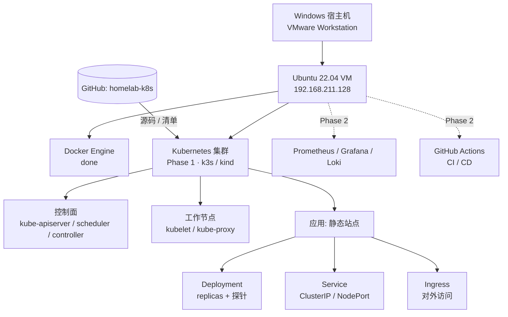

# homelab-k8s

> 个人云原生实验场:从单机 Docker 到 K8s 集群 + 可观测性 + CI/CD,作为云运维 / DevOps / SRE 转型的硬证据。
> 配套笔记见 [`homelab-notes`](https://github.com/1524529306/homelab-notes)。

## 目标

- 在本地 VM 跑通一套最小可用 K8s 集群;
- 把自己写的一个静态站点部署上去,配好探针与对外访问;
- 后续叠加 Prometheus / Grafana / Loki 监控 与 GitHub Actions 流水线;
- 最终目标:考取 CKA,把本仓库作为简历里的"个人项目"硬证据。

## 环境基线(Phase 0 已完成)

| 项 | 值 |
|---|---|
| 宿主机 | Windows + VMware Workstation Pro |
| 虚拟机 | Ubuntu 22.04 LTS Desktop (amd64) |
| 网络 | VMware NAT (vmnet8),VM IP 192.168.211.128 |
| 容器运行时 | Docker Engine 29.x(daocloud 镜像源) |
| 代码仓库 | GitHub: `homelab-k8s` / `homelab-notes` |

## 架构图

> 实线 = 当前已规划 / 进行中;虚线 = Phase 2 规划。

## Phase 1 计划(集群工具待定)

| 候选 | 特点 | 适用 |
|---|---|---|
| k3s | 轻量、单节点即可、containerd、kubectl 通用 | CKA 备考首选 |
| kind | 基于 Docker 起多节点、秒级 | 练集群拓扑 |

落地步骤(待工具确定后细化):

1. 安装 `kubectl`;
2. 安装集群(国内走镜像加速);
3. `kubectl get node` 验证节点 `Ready`;
4. 部署 `manifests/nginx-static.yaml`(Deployment + Service + 探针 + NodePort);
5. 本 README 补充真实访问方式(URL / 端口)。

## 当前进度

- [x] Phase 0:VM + Docker + GitHub 就绪
- [ ] Phase 1:K8s 集群跑通 + 首个应用部署
- [ ] Phase 2:监控 + 自动化 + CI/CD
- [ ] Phase 3:上云复刻 + 云证书

## 目录

- `docs/Phase0-环境搭建与踩坑实录.md` — 环境搭建全过程与排坑
- `scripts/install-docker.sh` — Docker 一键安装(国内镜像)
- `manifests/nginx-static.yaml` — Phase 1 首个部署清单(待集群就绪后应用)
